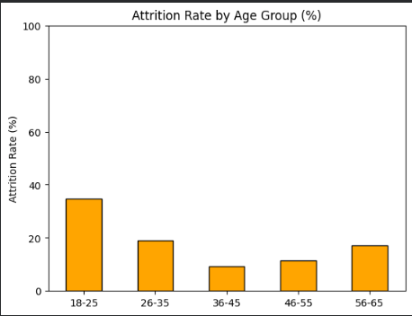
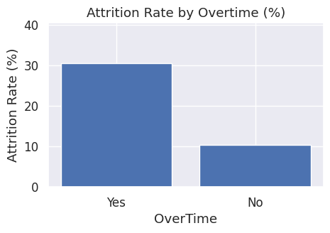
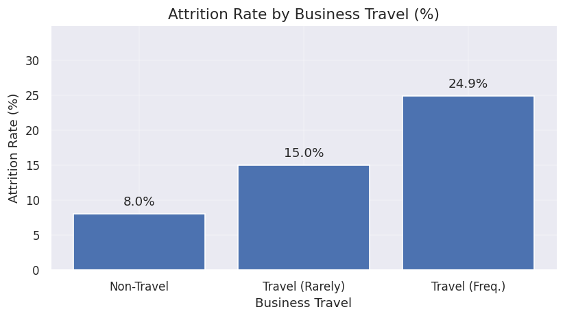

## Employee Attrition Analysis (Python)

**Quick links**
- Notebook: `employee_attrition_analysis.ipynb`
- Data: Kaggle – Employee Attrition (Patel Prashant)

**Tools:** Pandas, NumPy, Matplotlib, Seaborn, Scikit-learn  
**Goal:** Identify patterns and drivers of employee attrition using exploratory data analysis and visualization.

### Data Source
This project uses the public Kaggle dataset **Employee Attrition** by Patel Prashant.

- Source: https://www.kaggle.com/datasets/patelprashant/employee-attrition
- File: `WA_Fn-UseC_-HR-Employee-Attrition.csv`

### How to Run
1. Download the dataset from Kaggle.
2. Place the CSV in a local folder named `data/` (same directory level as the notebook).
3. Run the notebook.

### Key Findings (Summary)
- Higher attrition among early-career employees (18–25 group about 40% vs about 16% baseline).
- Overtime is associated with higher attrition (about 30.5% vs about 10% for non-overtime).
- Frequent travel is associated with higher attrition (about 25% vs about 8% for non-travellers).

### Key Visuals

**Attrition rate by age group**

**Attrition rate by overtime**

**Attrition rate by business travel**

